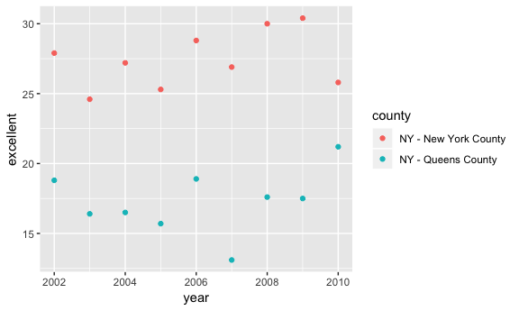

p8105\_hw2\_edm2152
================
Eric Morris
September 25, 2018

Problem 1
---------

Reading and cleaning the data; retaining line, station, name, station latitude / longitude, routes served, entry, vending, entrance type, and ADA compliance. Converting the entry variable from character (YES vs NO) to a logical variable using ifelse.

``` r
subway_data = 
  read_csv("./data/NYC_Transit_Subway_Entrance_And_Exit_Data.csv") %>% 
  janitor::clean_names() %>% 
  select(line:vending, - exit_only, vending, ada) %>% 
  mutate(entry = ifelse(entry == "YES", TRUE, FALSE))
```

    ## Parsed with column specification:
    ## cols(
    ##   .default = col_character(),
    ##   `Station Latitude` = col_double(),
    ##   `Station Longitude` = col_double(),
    ##   Route8 = col_integer(),
    ##   Route9 = col_integer(),
    ##   Route10 = col_integer(),
    ##   Route11 = col_integer(),
    ##   ADA = col_logical(),
    ##   `Free Crossover` = col_logical(),
    ##   `Entrance Latitude` = col_double(),
    ##   `Entrance Longitude` = col_double()
    ## )

    ## See spec(...) for full column specifications.

This dataset contains variables for the subway line (name), station name, longitude and latitude for station location, subway routes served by the station spread across columns, if the location is an entrance, the entrance type, whether or not there is a vending at the entrance, and if the entrance is ADA compliant. This dataset contains 1868 rows (observations) and 19 columns (variables). This dataset is relatively tidy but will be better once the route numbers are gathered.

There are 465 distinct stations in this dataset.

There are 84 ADA compliant stations among the 465 distinct stations.

``` r
prop_vend_entr = 
  (
  select(subway_data, entry, vending) %>% 
 filter(entry == TRUE) %>% 
  filter(vending == "NO") %>% 
  count()
/
  select(subway_data, vending) %>% 
 filter(vending == "NO") %>% 
  count()
)
```

The proportion of station entrances/exits without vending that allow entrance is 0.3770492

Reformatting the dataset so that route number and route name are distinct variables using the gather command:

``` r
subway_data_reformatted = 
  gather(subway_data, key = route_number, value = route_name, route1:route11)
```

``` r
distinct_A_stations = 
  distinct(subway_data_reformatted, line, station_name, route_name) %>% 
  filter(route_name == "A") %>% 
  nrow()

distinct_A_ADA = 
  distinct(subway_data_reformatted, line, station_name, route_name, ada) %>% 
  filter(route_name == "A") %>% 
  filter(ada == TRUE) %>% 
  nrow()
```

60 distinct stations serve the A train, 17 of these are ADA compliant.

Problem 2
---------

Importing Mr. Trash Wheel Data, cleaning variable names, filtering out rows without a dumpster value and changing sports balls to an integer:

``` r
mrtrash_data = 
  readxl::read_excel("./data/HealthyHarborWaterWheelTotals2018-7-28.xlsx", sheet = "Mr. Trash Wheel", range = "A2:N336") %>% 
  janitor::clean_names() %>% 
  filter(!is.na(dumpster)) %>% 
  mutate(sports_balls = as.integer(sports_balls))
```

Importing the precipitation data for 2016 and 2017 and joining them:

``` r
prcp2016 = 
  readxl::read_excel("./data/HealthyHarborWaterWheelTotals2018-7-28.xlsx", sheet = "2016 Precipitation", range = "A2:B14") %>% 
  janitor::clean_names() %>% 
  mutate(year = 2016)

prcp2017 = 
  readxl::read_excel("./data/HealthyHarborWaterWheelTotals2018-7-28.xlsx", sheet = "2017 Precipitation", range = "A2:B14") %>%
  janitor::clean_names() %>% 
  mutate(year = 2017)

prcpdata_16_17 = full_join(prcp2016, prcp2017) %>% 
  mutate(month = month.name[month])
```

    ## Joining, by = c("month", "total", "year")

``` r
med_sports_balls_2016 = 
  mrtrash_data %>% 
  filter(year == 2016) %>% 
  pull(sports_balls) %>% 
  median(na.rm = TRUE)

total_tons = 
  mrtrash_data %>% 
  pull(weight_tons) %>% 
  sum(na.rm = TRUE)

total_homes = 
  mrtrash_data %>% 
  pull(homes_powered) %>% 
  sum(na.rm = TRUE) %>% 
  round()

prcp_total_2016 = 
  prcpdata_16_17 %>% 
  filter(year == 2016) %>% 
  pull(total) %>% 
  sum(na.rm = TRUE) %>% 
  round(digits = 4)

prcp_total_2017 = 
  prcpdata_16_17 %>% 
  filter(year == 2017) %>% 
  pull(total) %>% 
  sum(na.rm = TRUE) %>% 
  round(digits = 4)
```

In the Mr. Trash data set, there are 14 data variables collected for 285 dumpsters. The median number of sports balls in a dumpster in 2016 was 26. The total weight collected by all dumpsters from May 2016 until the end of July 2018 was 934.94 tons. So far, 1.195110^{4} homes have been powered by Mr. Trash Wheel.

In the combined precipitation data set, there are 3 variables (month, total precipiation and year) and 24 months of observations (two years). The total precipitation in 2016 was 39.95 inches and the total precipitation in 2017 was 32.93 inches.

Problem 3
---------

Importing and tidying the BRFSS Data:

``` r
# install.packages("devtools")
devtools::install_github("p8105/p8105.datasets")
```

    ## Skipping install of 'p8105.datasets' from a github remote, the SHA1 (21f5ad1c) has not changed since last install.
    ##   Use `force = TRUE` to force installation

``` r
library(p8105.datasets)

brfss_data = brfss_smart2010 %>% 
  janitor::clean_names() %>% 
  filter(topic == "Overall Health") %>% 
  select(-class, -topic, -question, -sample_size, -(confidence_limit_low:geo_location)) %>% 
  spread(key = response, value = data_value) %>% 
  janitor::clean_names() %>% 
  mutate(prop_excellent_vgood = (excellent + very_good) / 100) %>% 
  rename(state = locationabbr, county = locationdesc)
```

``` r
unique_locations = 
brfss_data %>% 
  distinct(county) %>% 
  nrow()
```

There are 404 unique locations (counties) in the dataset.

``` r
#Viewing a tibble of all the states
brfss_data %>% 
  count(state)
```

    ## # A tibble: 51 x 2
    ##    state     n
    ##    <chr> <int>
    ##  1 AK       11
    ##  2 AL       18
    ##  3 AR       21
    ##  4 AZ       32
    ##  5 CA       52
    ##  6 CO       59
    ##  7 CT       47
    ##  8 DC        9
    ##  9 DE       27
    ## 10 FL      122
    ## # ... with 41 more rows

``` r
unique_states =
  brfss_data %>% 
  distinct(state) %>% 
  nrow()
```

Every state plus Washington D.C. is represented, as there are 51 unique "states" in the data set.

``` r
brfss_data %>% 
  count(state) %>% 
  filter(n == max(n))
```

    ## # A tibble: 1 x 2
    ##   state     n
    ##   <chr> <int>
    ## 1 NJ      146

New Jersey is the most observed state with 146 observations in the data set.

``` r
median_excellent_2002 = 
  brfss_data %>% 
  filter(year == 2002) %>% 
  pull(excellent) %>% 
  median(na.rm = TRUE)
```

The median "excellent" response value in 2002 is 23.6.

Below is a histogram of “Excellent” response values in the year 2002:

``` r
brfss_data %>% 
  filter(year == 2002) %>% 
  ggplot(aes(x = excellent)) + 
    geom_histogram()
```

    ## `stat_bin()` using `bins = 30`. Pick better value with `binwidth`.

    ## Warning: Removed 2 rows containing non-finite values (stat_bin).


Below is a scatterplot showing the proportion of “Excellent” response values in New York County and Queens County (both in NY State) in each year from 2002 to 2010:

``` r
brfss_data %>% 
  filter(county == "NY - New York County" | county == "NY - Queens County") %>% 
  ggplot(aes(x = year, y = excellent)) +
  geom_point(aes(color = county))
```


